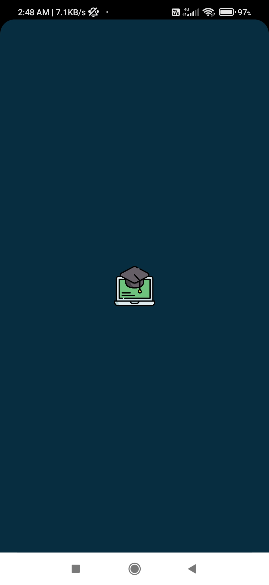
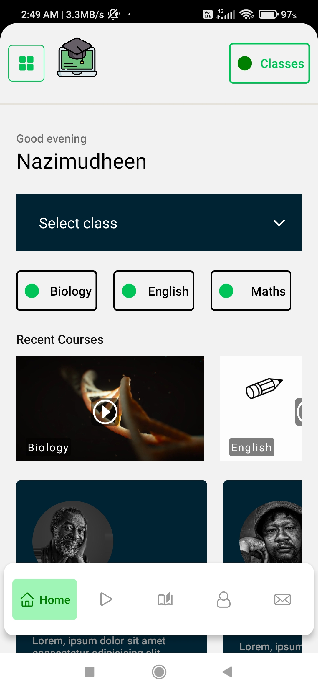
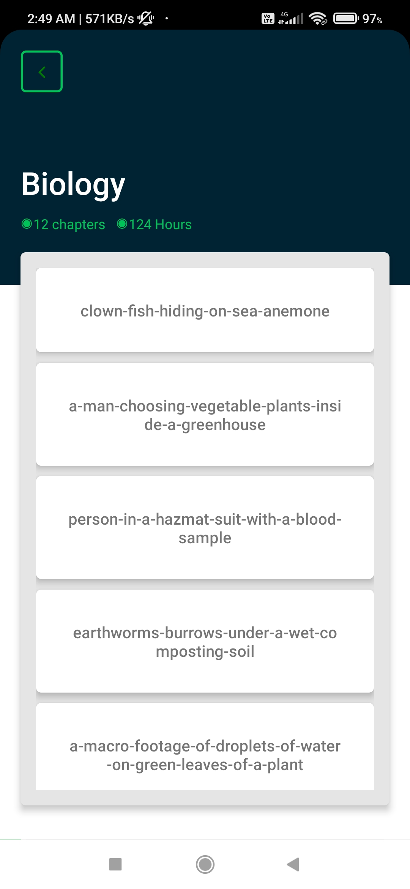
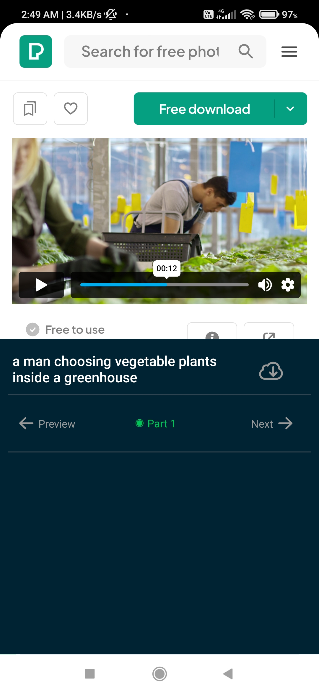

# Tutor App
This is a plain "Education App". Created for my course challenge. It has 4 register pages and What this app provide pages, actually I builded this app with android emulator and I don't know how this app's output in apple devices. Used static sources are Icons, fonts, Images, Videos.

## What I learn!!
I learned How to make a wrapper component and that was an "aaha" moment for me, understand how useEffect works with this amazing [Dmitri Pavlutin](https://dmitripavlutin.com/react-useeffect-explanation/) article.
The best thing is i founded a good styleSheet library ***styled components***. Below this page I shared good stuff source links those helped me this project journey.The library react-native-video only support "mp4" format that's why I choose **webview** for video stream on subject pages, and Pexel api provides different size of videos and images.

## Used Technologies
1. react-navigation
   1. @react-navigation/bottom-tabs
   2. @react-navigation/drawer
   3. @react-navigation/material-top-tabs
   4. @react-navigation/native-stack
2. styled-components
3. react-native-keyboard-aware-scroll-view
4. react-native-select-dropdown
5. react-native-vector-icons
6. react-native-video
7. react-native-webview
8. pexel api

## Preview

## Helped sources
1. [Learned How to create a wrapper component](https://www.digitalocean.com/community/tutorials/how-to-create-wrapper-components-in-react-with-props)
2. [OTP boxes](https://blog.logrocket.com/creating-split-otp-input-fields-react-native/)
3. [styled-component with react-native](https://blog.logrocket.com/how-to-use-styled-components-with-react-native/)
4. [boot-splash](https://www.javatpoint.com/react-native-splash-screen)
